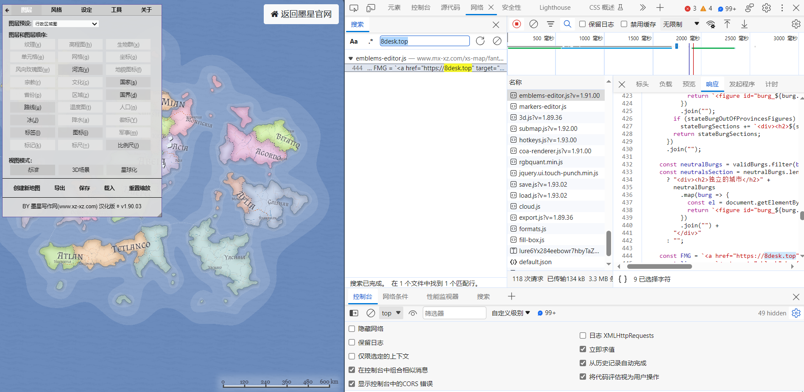

## 介绍

此为幻想地图生成器的中文个人汉化版本

- 官方原版👉[https://github.com/Azgaar/Fantasy-Map-Generator](https://github.com/Azgaar/Fantasy-Map-Generator)
- 汉化版国际节点👉[https://hk.8desk.top](https://hk.8desk.top)
- 汉化版国内节点👉[https://8desk.top](https://8desk.top)

## 支持

 

[支持原作者](https://www.patreon.com/azgaar)

## 注意墨星写作网这个倒卖他人成果的网站 https://www.mx-xz.com/

今天（2023-10-22）我建的交流群突然有人告诉我，有一个收费网站上有疑似盗搬我的作品的网站拿它卖钱。

我当时就去看了看，好家伙这个网站更新日志是跟我以前的一模一样，需要VIP会员才能使用。
它还说这是它自己汉化的，连我网站链接都没删干净。

[视频证据](https://www.bilibili.com/video/BV1uH4y197wY/)
[详细证据](https://wwue.lanzoub.com/il9sV1ci3aza)

我对汉化版的优化改动变成它优化改动的了，从去年汉化到现在变成它的独家首发了。

它甚至还倒卖作者其他的作品

气愤的是，它连原作者的链接都没放出来，MIT许可证是很宽松的一个证明。
被授权人有权利使用、复制、修改、合并、出版发行、散布、再授权及贩售软件及软件的副本。但是被授权人必须包含版权声明和许可声明。
> [Disscusion](https://github.com/Azgaar/Fantasy-Map-Generator/discussions/1003)